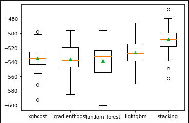

# DIAMONDS PRICE PREDICT

## 1. Project Overview

The aim of this project is to use the machine learning algorithms studied to predict the market price of 16k diamonds based on their individual characteristics.

In order to create our model and make this prediction, we have a dataset with another 40k different diamonds but with specified characteristics and price.

## 2. Datasets

- Full diamonds data set to train the model: [Acces to Data](data/diamonds_train.csv)
- Priceless Diamonds to make predictions: [Acces to Data](data/diamonds_predict.csv)

## 3. Technology stack
### Libraries Used
 - Pandas
 - Numpy
 - Sklearn
 - XGBoost
 - LightGBM
 - Pickle

### Folder structure
```
├── README.md
├── data
│   ├── diamonds_predict.csv
│   └── diamonds_train.csv
├── models
│   ├── finalized_gboost_model.sav
│   ├── finalized_stacking_model.sav
│   └── model_random_forest_400.4514702510914.sav
├── notebooks
│   ├── final_full_stacked_pipeline.ipynb
│   ├── model_gradientboost.ipynb
│   ├── model_lightgbm.ipynb
│   └── model_randomforest.ipynb
└── submisions
    ├── submission_randomForest_402.16532.csv
    ├── diamonds_gboost_390.77827039434936.csv
    ├── diamonds_gboost_394.18423043806155.csv
    └── diamonds_gboost_395.9147841670962.csv
```
## 4. Process

After several test and combinations of models ands preprocessing options we had our best scores with the following structure:

**Preprocessing**
- All categorical features (color,clarity and cut) are encoded and transfrom to ordinal numbers
- Outliers abobe percentile 99 are errased
- We create a pipeline for preprocess the data wich:
    - Applies a personaliced class to create a virtual dimension feature by multimpliying the 'x','y' and 'z' dimension of each diamond.
    - Divdide the carat size of our diamonds by this new dimensions to get a variable "carat/size" and drops all other dimension related features.
    - Fill gaps with median value of each serie
    - Applies and standar scaler to homogeinze the data

**Model Training**   
We created a stacked model based on the grouping of the following models:
- XGBRegressor
- GradientBoostingRegressor
- RandomForestRegressor
- LGBMRegressor
- LinearRegression

## 5. Results
<p align="center">
  
</p>

Public score of **505.85215** in a kaggle competition       
Private score of **551.26475** in the same competition

